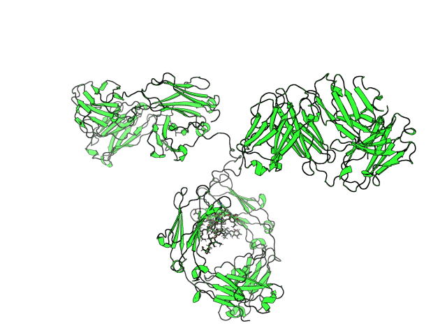
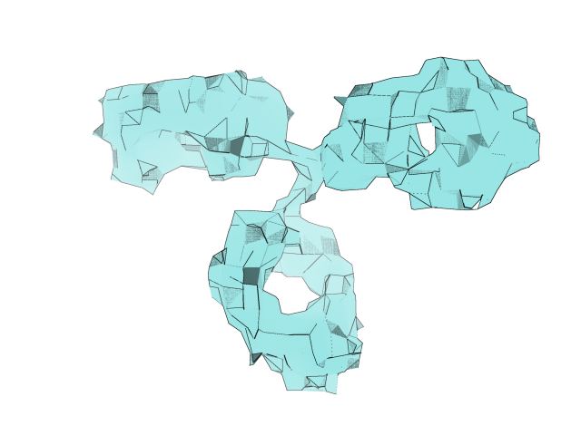

# PyMOL Low Poly Plugin

A PyMOL plugin that transforms molecular surfaces into a stylish low-poly (faceted) aesthetic. This tool simplifies the mesh geometry to create a clean, artistic look, complete with options for custom coloring, smoothing, and "cartoon-style" rendering with outlining.

## Cartoon style



## Low poly style



## Features
- **Low-Poly Surface Generation**: Simplifies molecular surfaces into faceted meshes.
- **Customizable Simplification**: Control the level of abstraction with the `factor` argument.
- **Advanced Coloring**: Support for single colors, custom palettes (cycling through chains), or default pastel schemes.
- **Smoothing**: Optional Laplacian smoothing to potential soften sharp geometry artifacts.
- **Cartoon Style**: Automatically applies high-quality rendering settings (matte finish, outlines, ambient lighting).

## Installation

### Manual Loading
1. Download `lowpoly.py` to your computer.
2. Open PyMOL.
3. Run the script using the command:
   ```pymol
   run /path/to/lowpoly.py
   ```
   *Tip: You can add this command to your `.pymolrc` file to load it automatically on startup.*

### Using Pixi (For Developers)
This project uses [pixi](https://pixi.sh/) for environment management.
1. Clone the repository.
2. Install dependencies:
   ```bash
   pixi install
   ```
3. Launch shell or run tests:
   ```bash
   pixi shell
   # then run pymol
   ```

## Usage

Once loaded, the `lowpoly` command is available in the PyMOL console.

### Syntax
```pymol
lowpoly [selection], [factor], [color], [cartoon_style], [name], [outline_color], [rounding]
```

### Arguments

| Argument | Type | Default | Description |
|----------|------|---------|-------------|
| `selection` | string | `all` | The atom selection to generate the surface for. |
| `factor` | float | `7.5` | Simplification intensity (grid size in Angstroms). Higher values create larger faces (more abstract). |
| `color` | string | `None` | Color strategy (diffuse color). See "Color Options" below. |
| `cartoon_style` | boolean | `True` | If True, applies matte materials, removes shininess, enables outlines, and sets high-quality sampling. |
| `name` | string | *auto* | The name of the resulting output object. |
| `outline_color` | string | `black` | Ray-trace outline color (requires `cartoon_style=True`). |
| `rounding` | int | `1` | Iterations of smoothing to apply. `0` = sharp raw clustering, `1+` = softer edges. |

### Color Options ( `color` argument )
- **Default (None)**: Uses a built-in pastel palette, coloring each chain differently.
- **Single Color**: Apply one color to the entire object.
  - Example: `color='red'`
- **Custom Palette**: Space-separated list of colors. It will cycle through these colors for each chain in the selection.
  - Example: `color='blue yellow white'`
- **'none'**: Do not bake any colors into the mesh vertices. This creates a white object that allows you to use the standard PyMOL `color` command on the object later.
  - Example: `color='none'`

## Examples

### 1. Basic Usage
Generate a low-poly surface for the entire molecule using default settings (factor 7.5, pastel colors).
```pymol
lowpoly
```

### 2. High Abstraction (More "Low Poly")
Increase the `factor` to make the triangles larger and the shape more abstract.
```pymol
lowpoly factor=12
```

### 3. Custom Colors per Chain
Color the chains using a specific sequence (e.g., Chain A red, Chain B blue, Chain C red...).
```pymol
lowpoly color='red blue'
```

### 4. Single Color with Custom Outline
Create a solid green surface with a dark grey outline.
```pymol
lowpoly color='green', outline_color='grey50'
```

### 5. Manual Coloring
Create a "clean" mesh without baked-in colors, then color it manually using PyMOL commands.
```pymol
lowpoly name=my_mesh, color='none'
color purple, my_mesh
```

### 6. Smoother Mesh
Apply more smoothing iterations to round off the edges of the clustered faces.
```pymol
lowpoly rounding=3
```
